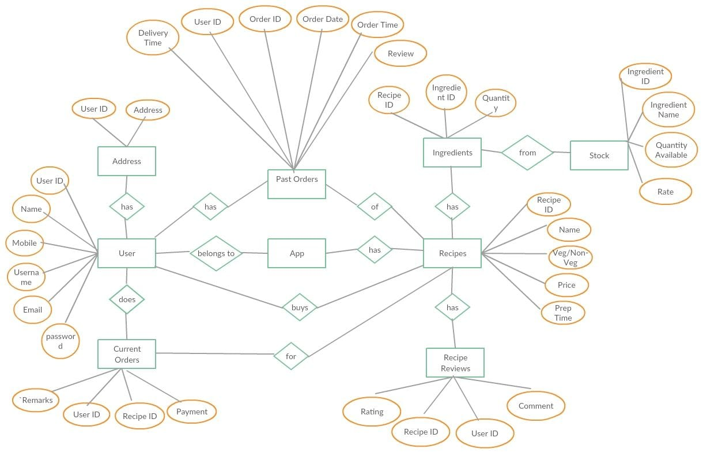

# Cook-at-Home

In today's busy world we get a lot of options to order food at home but it cannot satisfy our passion for cooking, In the proposed project we will define a new way for passionate people to cook any food at home without going through the hassle of finding and ordering all the ingredients.

## Installation


```bash
git clone https://github.com/kanhaiya38/cook-at-home.git
cd cook-at-home/
npm i
cd backend/
npm i
npm run dev
```
Open [localhost:3000](http://localhost:3000/) in the browser
## Usage

- Users are able to create and manage their account.
- Provides an easy way for enthusiastic home cooks to order required ingredients for the recipe.
- Removes all the hassle of going through a painful ordering process.
- Users are capable of searching through a huge library of recipes.
- Review system helps user to choose a better option among all the available recipes.
- Admin interface allows to keep track of stock of all the items in the inventory.
- Admin is able to manage deliveries and control the access rights by each user as per requirement.
- Generate daily reports for the admin.

## Technologies Used

- **Database:** MySQL
- **Front-End:** ReactJS, MaterialUI
- **Back-End:** NodeJS, ExpressJS 

## ER Diagram
 

## Screenshots


## Future Developments
- Allowing users to add various recipes and share them with the community. 
- Allow users to add videos of their own recipe.
## Contributing
- **Harshal Patil 111803160**
- **Kanhaiya Madaswar 111803162**
 
Pull requests are welcome. For major changes, please open an issue first to discuss what you would like to change.